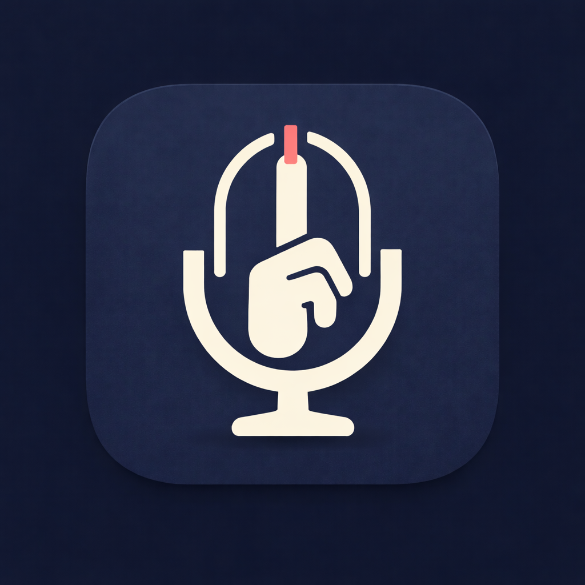

<p align="center">
  
</p>

<h1 align="center">HushType</h1>

<p align="center">
  Local voice-to-text for macOS and iOS.<br>
  Speak in any language mix — text appears at your cursor. No cloud. No subscription.
</p>

---

## Why HushType

**The problem:** You think faster than you type, especially when switching between languages. Apple's built-in dictation only handles one language at a time — say a sentence mixing English and Mandarin, and it falls apart. Cloud-based alternatives send your voice to someone else's server, add latency, and cost money.

**The solution:** HushType runs a state-of-the-art multilingual speech model (Qwen3-ASR) entirely on your Mac's GPU. Your voice never leaves your machine. It handles code-switching between English, Chinese, and Japanese in the same sentence, and automatically outputs Traditional Chinese for Mandarin input.

On macOS, it's a menu bar app — hold a key, speak, release, text appears. On iOS, it's a keyboard extension that sends audio to your Mac over your local network, so you get the same quality on your phone without any cloud service.

### Use Cases

**Bilingual professional writing emails:**
You're drafting a message that mixes English and Chinese. Instead of switching keyboards and typing in both languages, hold Right Option and say: "Please confirm the meeting time, 我們下週三下午兩點在台北市政府見面。" — the full sentence appears at your cursor, Chinese portions in Traditional Chinese.

**Voice notes on iPhone while commuting:**
You're on the subway with your Mac at home. Open HushType on iPhone, tap "Start Listening," switch to Notes, and tap the mic in the HushType keyboard. Speak naturally in any language — your audio travels over Tailscale to your Mac, gets transcribed in ~1 second, and the text appears in Notes. No internet required beyond your Tailscale mesh.

---

## How It Works

```
macOS (standalone — zero network required):
  Hold Right Option → speak → release → text at cursor
  Pipeline: mic → Qwen3-ASR (MLX, on-device) → OpenCC s2twp → paste

iOS (via your Mac as server):
  Open HushType → Start Listening → switch to any app → HushType keyboard → tap mic
  Pipeline: iPhone mic → WiFi/Tailscale → Mac server → Qwen3-ASR → OpenCC → result back → text inserted
```

```
                                     ┌──────────────────────────────────┐
                                     │  Mac (Apple Silicon)             │
  ┌──────────────┐   WiFi/Tailscale  │                                  │
  │ iPhone       │ ──── HTTP POST ──►│  ios_server.py (port 8000)       │
  │ HushType KB  │◄── JSON result ───│    ↓                             │
  └──────────────┘                   │  mlx-audio (port 8199)           │
                                     │    → Qwen3-ASR 0.6B (MLX/Metal) │
                                     │    → OpenCC s2twp                │
                                     │                                  │
                                     │  HushType.app (menu bar)         │
                                     │    → Right Option hotkey         │
                                     │    → Local transcription         │
                                     └──────────────────────────────────┘
```

---

## Prerequisites

| Requirement | Purpose |
|---|---|
| Mac with Apple Silicon (M1+) | MLX inference requires Metal GPU |
| macOS 15.0+ | Minimum OS for speech-swift |
| Homebrew | Installing opencc and other dependencies |
| Python 3.13+ | iOS server only (not needed for macOS-only use) |
| Xcode 16+ | Building the iOS app (not needed for macOS-only use) |
| iPhone with iOS 17+ | iOS client (optional) |
| Tailscale | iPhone-to-Mac connectivity from anywhere (optional — LAN also works) |

---

## Setup Guide: macOS

### Step 1: Clone and build

```bash
git clone https://github.com/felixfu824/HushType.git
cd HushType

# Install dependencies
brew install opencc

# Build and install to /Applications
make install
```

### Step 2: Launch and grant permissions

1. Launch HushType from Spotlight (Cmd+Space → HushType)
2. Grant **Accessibility** permission when prompted (System Settings > Privacy & Security > Accessibility > add HushType)
3. Grant **Microphone** permission when prompted
4. Wait for the model to download (~675 MB, one-time, progress shown in menu bar)

### Step 3: Use it

- **Hold Right Option** — start recording (menu bar icon changes)
- **Release** — transcribe and paste at cursor
- **Menu bar icon** — shows status (idle / recording / transcribing)
- **Menu bar > Language** — switch between Auto / English / Chinese / Japanese

That's it for macOS. No server, no network, no configuration needed.

---

## Setup Guide: iOS (iPhone + Mac Server)

The iOS app uses your Mac as the transcription server. Your iPhone sends audio to your Mac over WiFi or Tailscale, and receives the transcribed text back.

### Step 1: Install server dependencies on Mac

```bash
# Python packages for the transcription server
pip3 install "mlx-audio[stt,server]" webrtcvad-wheels setuptools httpx

# OpenCC for Traditional Chinese + xcodegen for iOS project
brew install opencc xcodegen
```

### Step 2: Get your Mac's IP address

```bash
# If using Tailscale (works from anywhere):
tailscale ip -4
# Example output: 100.75.151.28

# If using LAN only (same WiFi):
ipconfig getifaddr en0
# Example output: 192.168.50.50
```

Write down this IP — you'll enter it on your iPhone later.

### Step 3: Start the iOS server on Mac

**Option A — From HushType menu bar (recommended):**
Click the HushType icon in menu bar → "Start iOS Server"

**Option B — From terminal:**
```bash
cd HushType
python3 scripts/ios_server.py
# Server starts on 0.0.0.0:8000
# First transcription request will download the model (~675 MB)
```

Verify the server is running:
```bash
curl http://localhost:8000/
# Should return: {"status":"ok","service":"HushType iOS Server","opencc":true}
```

### Step 4: Build and install the iOS app

```bash
cd iOS
xcodegen generate
open HushType.xcodeproj
```

In Xcode:
1. Click the **HushType** project in the navigator (top left)
2. Select the **HushType** target → Signing & Capabilities → set **Team** to your Apple ID
3. Select the **HushTypeKeyboard** target → same thing, set **Team**
4. If Xcode shows "Update to recommended settings" → click **Perform Changes**
5. Connect iPhone via USB cable
6. Select your iPhone as the run destination (top bar)
7. Click **Run** (Cmd+R)

First-time build takes ~1 minute. Subsequent builds are faster.

### Step 5: Set up iPhone

These steps happen on the iPhone itself:

**5a. Enable Developer Mode** (one-time):
1. Settings → Privacy & Security → Developer Mode → toggle **On**
2. iPhone will restart. After restart, confirm "Turn On" when prompted.

**5b. Trust the developer** (one-time):
1. Settings → General → VPN & Device Management
2. Tap your Apple ID under "Developer App"
3. Tap **Trust**

**5c. Add the HushType keyboard** (one-time):
1. Settings → General → Keyboard → Keyboards → **Add New Keyboard**
2. Scroll down to "Third-Party Keyboards" → tap **HushType**
3. Tap **HushType** in the keyboard list → toggle **Allow Full Access** → confirm

> **Important:** Full Access must be enabled. Without it, the keyboard cannot communicate with the main app or access the network. If the mic button doesn't respond, this is the most common cause.

### Step 6: Configure and test

1. Open the **HushType** app on iPhone
2. Enter your Mac's IP address: `http://<your-ip>:8000` (the IP from Step 2)
3. Tap **Test Connection** → should show green "Connected"
4. Tap **Start Listening** — the orange microphone indicator appears at the top of the screen
5. The app shows a 5-minute countdown timer

### Step 7: Use it

1. Switch to any app (Messages, Notes, Safari, etc.)
2. Long-press the **globe key** on your keyboard → select **HushType**
3. Tap the **mic button** → speak → tap **stop**
4. Wait 1-2 seconds → transcribed text appears at your cursor
5. Use **space**, **backspace**, and **return** buttons for basic editing

When the 5-minute session expires, return to the HushType app and tap "Start Listening" again.

### After setup: Daily usage

You only need to repeat Steps 3 + 6-7 each day:
1. Make sure the iOS server is running on Mac (menu bar → "Start iOS Server")
2. Open HushType on iPhone → Start Listening
3. Switch to your app → use the keyboard

The USB cable is only needed for installing/updating the app from Xcode. Normal usage is wireless.

> **Note:** With free Apple ID provisioning, the app expires every 7 days. When it stops launching, reconnect USB → Xcode → Cmd+R to reinstall. Your settings are preserved. A paid Apple Developer account ($99/year) extends this to 1 year.

---

## Configuration

### macOS

```bash
# View all settings
defaults read com.felix.hushtype

# Language: nil=auto, "english", "chinese", "japanese"
defaults write com.felix.hushtype hushtype.language -string "chinese"

# Model: default 0.6B-4bit, alternative 1.7B for better quality
defaults write com.felix.hushtype hushtype.modelId -string "mlx-community/Qwen3-ASR-1.7B-8bit"

# Traditional Chinese conversion (default: true)
defaults write com.felix.hushtype hushtype.chineseConversionEnabled -bool false
```

### iOS

- Server URL: configured in the app UI (persisted in App Group)
- Session duration: 5 minutes (hardcoded in BackgroundAudioManager.swift)
- Model: `mlx-community/Qwen3-ASR-0.6B-4bit` (hardcoded in RemoteTranscriber.swift)

### Changing the Hotkey (macOS)

Edit `Sources/VoxKey/HotkeyManager.swift`:
```swift
private static let rightOptionKeyCode: Int64 = 61
```

Common keycodes: Right Option (61), Right Command (54), Left Option (58), Left Control (59), Fn/Globe (63).

---

## Project Structure

```
HushType/
├── Package.swift                      SPM config (macOS target)
├── Makefile                           build / install / clean
├── Sources/VoxKey/                    macOS menu bar app
│   ├── main.swift                     NSApplication bootstrap
│   ├── AppDelegate.swift              Orchestrator + state machine
│   ├── StatusBarController.swift      Menu bar icon + menus + iOS server toggle
│   ├── IOSServerManager.swift         Manages ios_server.py subprocess
│   ├── HotkeyManager.swift            CGEvent tap for Right Option
│   ├── AudioCaptureService.swift      AVAudioEngine mic capture (16kHz mono)
│   ├── TranscriptionEngine.swift      Protocol + Qwen3ASR wrapper (MLX)
│   ├── ChineseConverter.swift         OpenCC s2twp (Simplified → Traditional)
│   ├── TextInserter.swift             Clipboard + Cmd+V paste
│   ├── InputSourceManager.swift       CJK input method detection
│   └── AppConfig.swift                UserDefaults wrapper
├── scripts/
│   ├── ios_server.py                  FastAPI proxy: mlx-audio + OpenCC
│   └── build_mlx_metallib.sh          MLX Metal shader compilation
├── Resources/
│   ├── Info.plist                     LSUIElement, mic usage description
│   ├── HushType.png                   App icon (1024x1024)
│   └── HushType.icns                  macOS app icon
└── iOS/                               iPhone app + keyboard extension
    ├── project.yml                    xcodegen project spec
    ├── Shared/                        Shared between app + keyboard extension
    │   ├── AppGroupConstants.swift    App Group keys + file-based IPC
    │   ├── IPCConstants.swift         Darwin notification names
    │   └── WAVEncoder.swift           Float32 → 16-bit PCM WAV
    ├── VoxKey/                        Main iOS app
    │   ├── VoxKeyApp.swift            SwiftUI entry point (@main HushTypeApp)
    │   ├── Views/ContentView.swift    Server config, listening session, countdown
    │   ├── Services/
    │   │   ├── AudioRecorder.swift    AVAudioEngine with listening + recording modes
    │   │   ├── BackgroundAudioManager.swift  Session timer, IPC polling, background
    │   │   └── RemoteTranscriber.swift       HTTP multipart POST to Mac server
    │   ├── Assets.xcassets/           App icon asset catalog
    │   └── Resources/silence.wav      Background audio fallback
    └── VoxKeyKeyboard/                Custom keyboard extension
        └── KeyboardViewController.swift  Mic, space, backspace, return, globe

## Customizing for Your Own Setup

To run HushType on your own devices, change these:

| What | Where | Example |
|---|---|---|
| Bundle ID | `iOS/project.yml` (both targets) + `iOS/Shared/AppGroupConstants.swift` | `com.yourname.hushtype` / `group.com.yourname.hushtype` |
| Server URL default | `iOS/VoxKey/Views/ContentView.swift` | Your Tailscale or LAN IP |
| Hotkey | `Sources/VoxKey/HotkeyManager.swift` | Any modifier keycode |
| Model | `iOS/VoxKey/Services/RemoteTranscriber.swift` + `scripts/ios_server.py` | `mlx-community/Qwen3-ASR-1.7B-8bit` for better quality |
| Session timeout | `iOS/VoxKey/Services/BackgroundAudioManager.swift` | `sessionDuration` property |
| OpenCC config | `Sources/VoxKey/ChineseConverter.swift` + `scripts/ios_server.py` | Change `s2twp` to `s2t` for standard Traditional |

---

## Troubleshooting

**macOS: "MLX error: Failed to load the default metallib"**
Run: `bash scripts/build_mlx_metallib.sh release`

**macOS: Hotkey not working**
Check Accessibility permission. HushType (or Terminal if running via `make run`) must be listed.

**iOS: "App Transport Security" error**
The Info.plist must have `NSAllowsArbitraryLoads = true` with NO `NSExceptionDomains` — they conflict and cause iOS to ignore the global allow.

**iOS: Mic button does nothing (no recording starts)**
Most common cause: **Full Access is not enabled**. Go to Settings > General > Keyboard > Keyboards > HushType > toggle Allow Full Access. Without this, the keyboard extension cannot communicate with the main app.

**iOS: Keyboard stuck on "Transcribing..."**
The main app isn't receiving commands. Ensure:
1. HushType app is open and showing "Listening" with the orange mic dot
2. The Mac server is running (`curl http://<mac-ip>:8000/`)
3. App Group container works (check Xcode console for "App Group container: /path...")

**iOS: "Open HushType app first"**
The main app isn't running or the listening session expired (5-min timeout). Open HushType app and tap "Start Listening" again.

**iOS: App stops working after 7 days**
Free provisioning signing expires. Reconnect iPhone via USB, open Xcode, Cmd+R to reinstall. Settings are preserved.

**Server: Port already in use**
```bash
lsof -ti :8000 :8199 | xargs kill
```

---

## Known Limitations

- iOS requires Mac to be on and server running (no cloud fallback)
- Free provisioning: iOS app expires every 7 days (re-sign via Xcode)
- Session timeout is fixed at 5 minutes (no UI to change yet)
- Mac must be on the same network as iPhone (WiFi or Tailscale)

---

## Dependencies

| Dependency | Purpose | Install |
|---|---|---|
| [speech-swift](https://github.com/soniqo/speech-swift) | Qwen3-ASR on Apple Silicon (MLX) | Automatic via SPM |
| [opencc](https://formulae.brew.sh/formula/opencc) | Simplified → Traditional Chinese | `brew install opencc` |
| [mlx-audio](https://github.com/Blaizzy/mlx-audio) | STT server for iOS | `pip3 install "mlx-audio[stt,server]"` |
| [xcodegen](https://github.com/yonaskolb/XcodeGen) | iOS Xcode project generation | `brew install xcodegen` |
| [httpx](https://www.python-httpx.org/) | Async HTTP for proxy server | `pip3 install httpx` |
